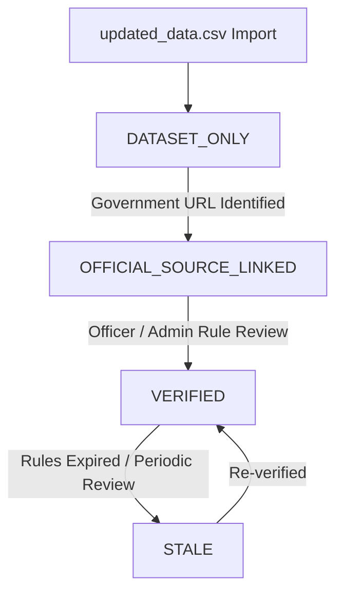
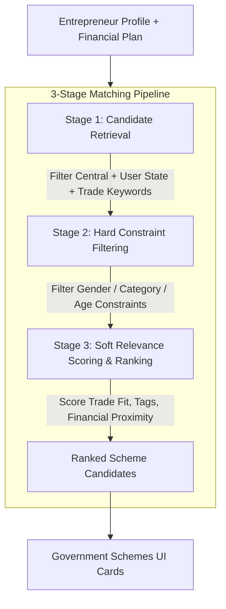

# Indian Government Schemes Dataset Audit & Architecture Plan

**Audit Date**: September 10, 2026  
**Dataset Location**: `backend/data/updated_data.csv`  
**Author**: UdyamMitra Architecture & Engineering Team  
**Scope**: Dataset Audit & Architecture Planning Only (No production code modifications)

---

## Executive Summary

This document presents a comprehensive audit of the newly introduced Indian Government Schemes dataset (`backend/data/updated_data.csv`, ~12.26 MB, 3,400 scheme records) and establishes the architectural blueprint for integrating a high-performance, personalized **Government Scheme Discovery Catalog** into UdyamMitra.

### Key Architectural Findings
1. **Separation of Concerns**: The imported dataset will power **Government Scheme Catalog & Discovery**, strictly preserving the existing, locked **Module 12 Smart Scheme Router** (`Micro Finance` ≤ ₹1.40L vs `Term Loan` > ₹1.40L to ₹50L) as the authoritative **Recommended Financing Pathway**.
2. **Financial Module Non-Regression**: Financial Plan calculations (project cost, owner contribution, debt requirement, DSCR, cash flows) remain the singular source of truth. The scheme recommendation engine will read these values read-only without duplicating formulas or changing calculations.
3. **Provenance & Trust**: All imported records are classified as `DATASET_ONLY` by default. Candidate matches are presented as *"Potentially relevant discovery opportunities"*, never as *"Confirmed official eligibility"*.
4. **Data Integrity**: 3,400 data records across 11 CSV columns (including 1 empty artifact column). 541 Central schemes (15.91%) and 2,859 State schemes (84.09%), with 82+ identified Maharashtra state-specific schemes.

---

## 1. Dataset File Specifications

| Metric | Measured Value | Notes |
| :--- | :--- | :--- |
| **File Path** | `backend/data/updated_data.csv` | Located in backend dataset directory |
| **File Size** | `12,855,490 bytes` (12.26 MB) | Third-party aggregated dataset |
| **Encoding** | `UTF-8` | Contains Devanagari text (Hindi/Marathi), currency symbols (`₹`), quotes, and special characters |
| **Total Lines** | `3,401 lines` | 1 Header row + 3,400 data rows |
| **Total Records** | `3,400 rows` | 3,397 unique scheme records |
| **Parsing Health** | `0 errors` | Standard RFC 4180 CSV compliance; all rows parse cleanly |

---

## 2. Exact Header Schema & Column-by-Column Analysis

The CSV contains **11 columns** in the header line:  
`scheme_name, slug, details, benefits, eligibility, application, documents, level, schemeCategory, , tags`

```
Col  0: scheme_name     [TEXT] - Scheme title
Col  1: slug            [TEXT] - Unique slug / abbreviation
Col  2: details         [TEXT] - Detailed scheme description, objectives, and administrative body
Col  3: benefits        [TEXT] - Quantitative & qualitative assistance, subsidies, loans, grants
Col  4: eligibility     [TEXT] - Criteria covering age, gender, caste, income, enterprise type
Col  5: application     [TEXT] - Step-by-step application guidance, portal URLs, offline offices
Col  6: documents       [TEXT] - Required certificates, identity cards, project reports
Col  7: level           [TEXT] - 'Central' or 'State'
Col  8: schemeCategory  [TEXT] - Comma-separated category tags
Col  9: (unnamed "")    [TEXT] - Empty artifact column (100% missing, generated by double comma)
Col 10: tags            [TEXT] - Comma-separated search and topic tags
```

### Detailed Column Metrics

| Index | Column Name | Type | Missing Count | Missing % | Unique Values | Min / Avg / Max Characters | Catalog Role | Recommendation Role | Normalization Required |
| :---: | :--- | :---: | :---: | :---: | :---: | :---: | :---: | :---: | :---: |
| **0** | `scheme_name` | String | 0 | 0.00% | 3,397 | 5 / 55.5 / 246 | Primary Title | Keyword match | Trim whitespace, clean quotes |
| **1** | `slug` | String | 0 | 0.00% | 3,397 | 2 / 7.3 / 68 | Unique URL Key | Identification | Lowercase, append suffix on collision |
| **2** | `details` | Text | 0 | 0.00% | 3,382 | 109 / 790.9 / 8,630 | Full Description | Full-text search | Strip formatting artifacts / BOM |
| **3** | `benefits` | Text | 0 | 0.00% | 3,304 | 8 / 509.6 / 16,972 | Benefits Display | Benefit type scoring | Clean currency symbols and bullets |
| **4** | `eligibility` | Text | 0 | 0.00% | 3,274 | 26 / 650.9 / 9,135 | Eligibility Tab | Constraint matching | Extract structured parameters |
| **5** | `application` | Text | 2 | 0.06% | 2,511 | 1 / 1148.3 / 11,384 | How to Apply | URL extraction | Parse URLs and step lists |
| **6** | `documents` | Text | 10 | 0.29% | 3,054 | 1 / 472.5 / 8,155 | Checklist Tab | Document checklist | Parse into clean arrays |
| **7** | `level` | Enum | 0 | 0.00% | 2 | 5 / 5.3 / 7 | Filter (Central/State) | Hard State Filter | Map to uppercase `CENTRAL` / `STATE` |
| **8** | `schemeCategory`| String | 0 | 0.00% | 210 | 15 / 34.0 / 172 | Primary Category | Domain matching | Split comma strings into JSONB array |
| **9** | `""` (Empty) | Null | 3,400 | 100.00% | 1 | 0 / 0.0 / 0 | **DROP** | **None** | Discard during import |
| **10**| `tags` | String | 29 | 0.85% | 3,272 | 4 / 60.1 / 249 | Search Badges | Trade/Skill matching | Split comma strings into JSONB array |

---

## 3. Data Quality, Duplication & Anomaly Findings

### 1. Duplicate Records
- **Total Duplicate Rows**: Exactly 3 duplicate rows (across 2 unique scheme names):
  1. `Establishment of Goat Unit (10 +1)` (slug: `eogu`, Level: `State`) — appears 3 times (rows 898, 899, 900).
  2. `Valmiki Chhatravritti Yojana` (slug: `vcy`, Level: `State`) — appears 2 times (rows 3270, 3271).
- **Resolution**: Importer must use idempotent upsert logic (`ON CONFLICT (slug) DO UPDATE` or deduplicate by `(scheme_name, level, state)`).

### 2. Header Anomaly (Column 9)
- Column 9 has an empty header string `""` caused by a trailing double comma `, ,` in the raw CSV header. It contains 100% empty values and must be dropped cleanly in the ETL pipeline.

### 3. Unicode & Formatting Artifacts
- **Zero-Width No-Break Space (BOM `\ufeff`)**: Present in multiple records before section titles (e.g. ` Objectives:`, ` Eligibility:`).
- **Devanagari Scripts**: Present in Maharashtra / Hindi scheme records (e.g. `शासन निर्णय क्र. योजना-२०१९`).
- **Currency Symbols**: `₹`, `Rs.`, `Rs`, `lakh`, `crore` used inconsistently.

---

## 4. Central vs. State Structure & Geographic Coverage

### Distribution by Level
- **State Schemes**: **2,859 records (84.09%)**
- **Central Schemes**: **541 records (15.91%)**
- **Total**: 3,400 records (100% categorized, 0 missing level).

### State Identification & Distribution
The dataset does not contain a dedicated `state` column. However, state administrative boundaries are embedded in the scheme text, eligibility criteria, department names, and application URLs.

Automated entity extraction across all 36 Indian States and Union Territories yields:
- **Identified State Schemes**: **2,792 schemes (97.66% of state schemes)**
- **Unidentified State Schemes**: **67 schemes (2.34%)**

#### State-wise Scheme Distribution (Top 20)
```
Gujarat                : 288 schemes
Tamil Nadu             : 232 schemes
Puducherry             : 222 schemes
Haryana                : 191 schemes
Madhya Pradesh         : 178 schemes
Goa                    : 152 schemes
Rajasthan              : 131 schemes
West Bengal            : 108 schemes
Bihar                  : 102 schemes
Chhattisgarh           : 100 schemes
Jharkhand              :  95 schemes
Maharashtra            :  82 schemes (113 total text mentions)
Kerala                 :  73 schemes
Odisha                 :  72 schemes
Andhra Pradesh         :  68 schemes
Himachal Pradesh       :  64 schemes
Karnataka              :  61 schemes
Meghalaya              :  57 schemes
Delhi                  :  51 schemes
Punjab                 :  51 schemes
```

### Maharashtra State Coverage
The dataset provides rich coverage for Maharashtra state entrepreneurs, with 82+ dedicated state schemes and 113 total references including flagship programs:
1. **CHIEF MINISTER EMPLOYMENT GENERATION PROGRAMME (CMEGP)** — High relevance for rural micro/small enterprise capital subsidy up to ₹50L.
2. **Bhausaheb Fundkar Falbag Lagvad Scheme** — Horticultural and agro-business plantation subsidies.
3. **Magel Tyala Shettale (Individual Farm Pond Scheme)** — Rural agricultural and irrigation infrastructure.
4. **Craftsman Training Scheme - Maharashtra** — Technical skill development and trade stipends.
5. **Dr. Panjabrao Deshmukh Hostel Maintenance Allowance** — Education and vocational assistance.
6. **Aam Aadmi Bima Yojana (Maharashtra)** — Social security for unorganized/rural workers.

---

## 5. Scheme Category & Tag Taxonomy

### Top Normalized Categories
```
1. Social Welfare & Empowerment          : 1,281 schemes
2. Education & Learning                   :   834 schemes
3. Business & Entrepreneurship            :   515 schemes
4. Agriculture, Rural & Environment       :   481 schemes
5. Women and Child                        :   376 schemes
6. Skills & Employment                    :   265 schemes
7. Banking, Financial Services & Insurance:   223 schemes
8. Health & Wellness                      :   218 schemes
9. Sports & Culture                       :   118 schemes
10. Housing & Shelter                     :    92 schemes
11. Science, IT & Communications          :    69 schemes
12. Transport & Infrastructure            :    54 schemes
```

### Top Tags in Dataset
`Financial Assistance` (1,063), `Student` (461), `Subsidy` (307), `Scholarship` (292), `Labour` (273), `Education` (263), `Construction Worker` (255), `Farmer` (212), `Agriculture` (210), `Entrepreneurship` (204), `Scheduled Caste` (197), `Social Welfare` (196), `Pension` (190), `Business` (177), `Building Worker` (165), `Loan` (143), `Training` (137), `Disability / PwD` (133), `Scheduled Tribe` (107), `Widow` (95), `Reimbursement` (93), `Women` (92).

---

## 6. UdyamMitra 8 Canonical Businesses Relevance Audit

| # | UdyamMitra Canonical Business | Potential Candidate Matches | Match Breakdown | Representative Candidate Schemes | Key Matching Fields |
| :-: | :--- | :-: | :--- | :--- | :--- |
| **1** | **Tailoring / Alteration** | **134 schemes** | Powerloom subsidies, textile incentives, apparel training, sewing kits | - *Incentive Scheme for MSMEs in Powerloom Sector*<br>- *West Bengal Textile Incentive Scheme*<br>- *Craftsman Training Scheme (Garment Making)* | `details`, `tags`, `schemeCategory`, `eligibility` |
| **2** | **Mobile Repair & Accessories** | **183 schemes** | Technical skill training, electronics toolkits, SME equipment subsidies | - *In-Plant Training (Development of Industries)*<br>- *Toolkits for Technical Trades Scheme*<br>- *Chief Minister Employment Generation Programme* | `benefits`, `tags`, `details`, `eligibility` |
| **3** | **Kirana / General Store** | **58 schemes** | Retail trade credit, vendor margin money, women retail enterprise support | - *Consortia & Tender Marketing Scheme*<br>- *Indira Mahila Shakti Udyam Protsahan Yojana*<br>- *Micro Enterprise Trade Credit Support* | `details`, `benefits`, `tags`, `eligibility` |
| **4** | **Dairy Enterprise** | **185 schemes** | Milk chilling units, cow/buffalo purchase subsidies, livestock credit | - *Acharya Vidyasagar Gau Samvardhan Yojana*<br>- *Advanced Animal Breeding Scheme*<br>- *Dairy Entrepreneurship Development Assistance* | `details`, `tags`, `eligibility`, `benefits` |
| **5** | **Poultry Enterprise** | **67 schemes** | Broiler/layer sheds, backyard poultry kits, livestock subsidies | - *Breed Multiplication Farm Entrepreneurship*<br>- *Backyard Poultry Development Scheme*<br>- *Small Animal Husbandry Assistance* | `details`, `tags`, `eligibility`, `benefits` |
| **6** | **Flour Mill** | **13 schemes** | Agro-processing mills, grain processing units, village chakki subsidies | - *Agro-Processing under CMEGP*<br>- *Capital Investment Subsidy: Thrust Area Industries*<br>- *Rural Mechanization and Milling Grant* | `details`, `eligibility`, `benefits` |
| **7** | **Food Processing Unit** | **74 schemes** | Micro food enterprise formalisation, value addition, food preservation | - *PM Formalisation of Micro food processing (PMFME)*<br>- *Agro Food Processing Capital Subsidy*<br>- *Spices and Fruit Preservation Assistance* | `details`, `schemeCategory`, `tags`, `benefits` |
| **8** | **Agricultural Equipment Rental** | **138 schemes** | Custom hiring centers, farm machinery subsidy, agricultural toolkits | - *Mukhyamantri Shramik Aujaar Sahayata Yojana*<br>- *Farm Mechanization Support (Tractor/Implements)*<br>- *Sub-Mission on Agricultural Mechanization (SMAM)* | `details`, `tags`, `benefits`, `eligibility` |

> [!IMPORTANT]
> A keyword/text candidate match indicates **POTENTIAL RELEVANCE** for discovery. It does **NOT** establish confirmed official eligibility.

---

## 7. Entrepreneur Profile Matching Matrix

| UdyamMitra Profile Field | Existing Profile Type | Dataset Support | Match Strength | Dataset Field(s) | Match Capabilities & Limitations |
| :--- | :--- | :---: | :---: | :--- | :--- |
| **State** | `state: str` | **Yes** | **STRONG** | Derived `state` + `level` (`Central`/`State`) | Central schemes apply to all states. State schemes match user's state directly. |
| **District** | `district: str` | **Partial** | **WEAK** | `details`, `eligibility` text | Rarely specified in dataset except special tribal/border area programs. |
| **Taluka / Village / Pincode** | `taluka`, `village`, `pincode` | **No** | **NONE** | None | Dataset operates at National and State levels. |
| **Social Category** | `category: Category` (General, SC, ST, OBC, Minority) | **Yes** | **STRONG** | `eligibility`, `tags`, `schemeCategory` | 785+ schemes have explicit SC/ST/OBC/Minority criteria and reservations. |
| **Gender** | User profile gender | **Yes** | **STRONG** | `eligibility`, `tags`, `schemeCategory` | 666+ schemes have women-focused provisions or higher subsidy percentages. |
| **Age Group** | `age_group: AgeGroup` (Below 25, 25-35, 36-50, 50+) | **Yes** | **MODERATE** | `eligibility` text (29.5% mention age) | Text extraction can match age ranges (e.g. 18-45 years). |
| **Proposed Business** | `proposed_business_id: UUID` | **Yes** | **STRONG** | `scheme_name`, `details`, `schemeCategory`, `tags` | Direct domain and trade keyword matching against 8 canonical businesses. |
| **Education** | `education: EducationLevel` | **Partial** | **MODERATE** | `eligibility` text | Identifies criteria like 8th/10th pass, ITI, or technical diploma. |
| **New vs Existing Unit** | `has_existing_business: bool` | **Partial** | **MODERATE** | `details`, `eligibility` | Distinguishes new enterprise setup vs modernization/expansion. |
| **Financial Context** | `project_cost`, `own_capital`, `loan_required` | **Partial** | **MODERATE** | `benefits`, `eligibility` text | Soft filtering based on stated loan/subsidy ceiling ranges (read-only). |
| **Skills** | `skills: List[SelectionItem]` | **Yes** | **MODERATE** | `tags`, `details`, `schemeCategory` | Matches vocational skills (Tailoring, Repairing, Dairy, Food Processing). |
| **Resources** | `resources: List[SelectionItem]` | **Partial** | **WEAK** | `eligibility`, `documents` text | Free-text mention of land, shed, or electricity availability. |
| **Preferred Language** | `preferred_language: PreferredLanguage` | **No** | **NONE** | English only | Dataset text is in English; UI chrome localizes in EN/HI/MR. |

---

## 8. Structural Analysis: Eligibility, Benefits, Application & Documents

### 1. Eligibility Criteria Structure
- **Format**: Semi-structured bullet points / sentences (e.g. *"The applicant should be a resident of... The age must be between 18 and 45... The annual income should not exceed ₹2,00,000..."*).
- **Prevalence**:
  - Age Criteria: **29.5%** (1,003 schemes)
  - Gender Criteria: **19.6%** (666 schemes)
  - Income Limits / BPL: **28.1%** (954 schemes)
  - Social Category (SC/ST/OBC): **23.1%** (785 schemes)
  - Landholding / Farmer status: **10.6%** (360 schemes)
  - MSME / Enterprise status: **11.3%** (384 schemes)

### 2. Benefits Structure
- **Format**: Free-text quantitative and qualitative terms.
- **Prevalence**:
  - Subsidies (Capital/Interest/Margin): **12.8%** (436 schemes)
  - Loans / Credit / Interest Subvention: **11.6%** (393 schemes)
  - Scholarships / Educational Stipends: **13.9%** (471 schemes)
  - Training & Skill Development: **9.9%** (337 schemes)
  - Toolkits, Machinery & Equipment: **6.6%** (225 schemes)
  - Pensions / Social Welfare: **5.6%** (192 schemes)
  - Insurance: **3.2%** (110 schemes)

### 3. Application Process Structure
- **Format**: Step-by-step procedural guides (e.g. `Step 1: Visit portal... Step 2: Fill form...`).
- **Portal Link Availability**: **629 schemes (18.5%)** contain valid government portal URLs (`*.gov.in` / `*.nic.in`).

### 4. Required Documents Structure
- **Format**: Semicolon or newline-separated document lists.
- **Common Requirements**: Aadhaar Card, Proof of Residence/Domicile, Caste Certificate, Income Certificate, Bank Passbook, Passport Photographs, Project Feasibility Report, Land 7/12 / Mutation records, Udyam Registration Certificate.

---

## 9. Official Source, Provenance & Verification Architecture

### Source Origin & URL Audit
- The dataset is derived from aggregated public portals (such as MyScheme and state department repositories).
- **Direct Government URLs Found**: 807 `.gov.in` / `.nic.in` domains across 629 schemes (e.g., `ikhedut.gujarat.gov.in`, `saralharyana.gov.in`, `serviceonline.gov.in`, `mahadbt.maharashtra.gov.in`).
- **Official Gazette / Circular PDFs**: Not directly attached in the CSV.

### Provenance Classification Framework
To maintain transparency and prevent misleading entrepreneurs, every scheme in the catalog must carry an explicit verification status:



1. `DATASET_ONLY` *(Default for all imported records)*:
   - Imported from aggregated discovery dataset.
   - Disclaimer displayed: *"Discovery match from public dataset. Verify current terms with the administering authority before applying."*
2. `OFFICIAL_SOURCE_LINKED`:
   - Official government portal or circular verified and linked.
3. `VERIFIED`:
   - Rules, eligibility, and subsidy ceilings independently verified against the latest government order.
4. `STALE`:
   - Previously verified record requiring periodic re-validation.

---

## 10. Existing Scheme Architecture & Financial Module Non-Regression

### Existing Module 12 (Smart Scheme Router) — LOCKED
- **Rule Boundary**: `MICRO_PROJECT_COST_MAX = Decimal("140000.00")`
- **Micro Finance Scheme**: Project cost ≤ ₹1.40L, max loan ₹1.25L, 6.50% interest, 36 months tenure, 3 months moratorium.
- **Term Loan Scheme**: Project cost > ₹1.40L to ₹50L, max loan ₹45L, 8.00% interest, 84 months tenure, 6 months moratorium.
- **Role**: This represents the **Recommended Financing Pathway** mandated by the SIH prototype baseline. It must remain 100% intact and independent.

### Architectural Separation
```
+-------------------------------------------------------------------------------+
|                             GOVERNMENT SCHEMES                                |
+-------------------------------------------------------------------------------+
|                                                                               |
|  [SECTION 1: YOUR FINANCING PATHWAY]                                          |
|  --> Existing Module 12 Smart Scheme Router (LOCKED & PRESERVED)               |
|  --> Input: Financial Plan Project Cost (≤ ₹1.40L vs > ₹1.40L)                 |
|  --> Output: Micro Finance or Term Loan Scheme Definition                     |
|                                                                               |
|  ---------------------------------------------------------------------------- |
|                                                                               |
|  [SECTION 2: RECOMMENDED GOVERNMENT SCHEMES]                                  |
|  --> New 3,400-Scheme Discovery Engine                                        |
|  --> Input: State, Social Category, Gender, Proposed Business, Profile        |
|  --> Read-Only Context: Financial Plan Project Cost (if available)            |
|  --> Output: Ranked Relevant Scheme Cards (Tagged as "Discovery Match")       |
|                                                                               |
|  ---------------------------------------------------------------------------- |
|                                                                               |
|  [SECTION 3: EXPLORE ALL SCHEMES]                                             |
|  --> Full Search & Filter Catalog (Level, State, Category, Benefit Type)      |
|                                                                               |
+-------------------------------------------------------------------------------+
```

---

## 11. Proposed Database Schema (PostgreSQL)

*(For implementation in the next task — do not create migrations now)*

### Table: `government_schemes`

```sql
CREATE TABLE government_schemes (
    id UUID PRIMARY KEY DEFAULT gen_random_uuid(),
    slug VARCHAR(120) NOT NULL UNIQUE,
    scheme_name VARCHAR(300) NOT NULL,
    level VARCHAR(20) NOT NULL CHECK (level IN ('CENTRAL', 'STATE')),
    state VARCHAR(100) NULL,
    category VARCHAR(150) NULL,
    categories JSONB NOT NULL DEFAULT '[]'::jsonb,
    tags JSONB NOT NULL DEFAULT '[]'::jsonb,
    details TEXT NOT NULL,
    benefits TEXT NOT NULL,
    eligibility TEXT NOT NULL,
    application_process TEXT NULL,
    documents_required TEXT NULL,
    official_url VARCHAR(500) NULL,
    source_name VARCHAR(100) NOT NULL DEFAULT 'myScheme Aggregated Dataset',
    source_year INT NULL DEFAULT 2024,
    verification_status VARCHAR(30) NOT NULL DEFAULT 'DATASET_ONLY' 
        CHECK (verification_status IN ('DATASET_ONLY', 'OFFICIAL_SOURCE_LINKED', 'VERIFIED', 'STALE')),
    last_verified_at TIMESTAMPTZ NULL,
    is_active BOOLEAN NOT NULL DEFAULT TRUE,
    search_vector TSVECTOR NULL,
    created_at TIMESTAMPTZ NOT NULL DEFAULT NOW(),
    updated_at TIMESTAMPTZ NOT NULL DEFAULT NOW()
);

-- Indexes for high-performance filtering & full-text search
CREATE INDEX idx_gov_schemes_level ON government_schemes(level);
CREATE INDEX idx_gov_schemes_state ON government_schemes(state);
CREATE INDEX idx_gov_schemes_category ON government_schemes(category);
CREATE INDEX idx_gov_schemes_verification ON government_schemes(verification_status);
CREATE INDEX idx_gov_schemes_categories_gin ON government_schemes USING GIN (categories);
CREATE INDEX idx_gov_schemes_tags_gin ON government_schemes USING GIN (tags);
CREATE INDEX idx_gov_schemes_search ON government_schemes USING GIN (search_vector);
```

---

## 12. Proposed Importer Architecture (ETL Pipeline)

*(To be implemented in `backend/scripts/import_government_schemes.py` in the next task)*

```
[backend/data/updated_data.csv]
            |
            v
[1. CSV Validation & Cleaning]
  - Discard empty Column 9
  - Strip UTF-8 BOM, non-breaking spaces, and normalize whitespace
            |
            v
[2. Entity Extraction & Normalization]
  - Map `level` to UPPERCASE ('CENTRAL' / 'STATE')
  - Detect `state` using dictionary matching on State schemes (97.7% accuracy)
  - Split comma-separated `schemeCategory` and `tags` into structured JSON arrays
  - Extract government URLs from `application` and `details`
            |
            v
[3. Deduplication & Slug Sanitization]
  - Deduplicate on `(scheme_name, level, state)`
  - Ensure globally unique slug (append `-state-suffix` on collision)
            |
            v
[4. PostgreSQL Upsert Transaction]
  - Batch insert with `ON CONFLICT (slug) DO UPDATE`
  - Update `search_vector = to_tsvector('english', scheme_name || ' ' || details || ' ' || tags)`
  - Atomic transaction rollback on unhandled error
            |
            v
[5. Structured Import Summary Report]
  - Total read, inserted, updated, skipped, and state distribution log
```

---

## 13. Proposed Recommendation Architecture



### Matching Rules
1. **Hard Geographic Filter**: If scheme is `STATE`, `scheme.state` MUST match `profile.state`. Central schemes (`level == 'CENTRAL'`) match all states.
2. **Hard Demographic Filter**: If scheme explicitly specifies women-only, non-female profiles are excluded. If scheme is SC/ST specific, non-matching profiles are filtered out.
3. **Soft Trade Scoring**:
   - Primary trade keywords match (+50 points).
   - Tag overlap (+15 points per matching tag).
   - Category alignment (+20 points).
4. **Transparent Match Reasons**: Each recommended card displays explicit rationale (e.g. *"Matches your proposed Dairy enterprise in Maharashtra"* or *"Targeted scheme for Women Entrepreneurs in Micro Enterprises"*).

---

## 14. Proposed Government Schemes UI

*(To be built in subsequent frontend tasks)*

```
================================================================================
  GOVERNMENT SCHEMES & FINANCING PATHWAYS
  Transparent financing guidance and scheme discovery for rural enterprises
================================================================================

[TAB 1: YOUR FINANCING PATHWAY] (Module 12)
+------------------------------------------------------------------------------+
| RECOMMENDED: Micro Finance Scheme (Up to ₹1.40 Lakh)                         |
| Max Loan: ₹1,25,000 | Interest: 6.5% p.a. | Tenure: 3 Yrs | Moratorium: 3 Mo |
| [View Financing Rules]  [Recalculate in Financial Plan]                      |
+------------------------------------------------------------------------------+

[TAB 2: RECOMMENDED FOR YOUR ENTERPRISE] (Personalized Discovery)
+------------------------------------+  +------------------------------------+
| CHIEF MINISTER EMPLOYMENT          |  | PM Formalisation of Micro food     |
| GENERATION PROGRAMME (CMEGP)       |  | processing Enterprises (PMFME)     |
| Level: Maharashtra State Scheme    |  | Level: Central Scheme              |
| Category: Business & MSME          |  | Category: Food Processing          |
| Why it matches:                    |  | Why it matches:                    |
| • Matches Tailoring in Maharashtra |  | • Matches Food Processing Unit     |
| • Capital subsidy up to 25-35%     |  | • 35% Credit-linked subsidy        |
| [View Scheme Details]              |  | [View Scheme Details]              |
+------------------------------------+  +------------------------------------+

[TAB 3: EXPLORE ALL SCHEMES] (Search & Filter)
Filters: [Level: All | Central | State] [State: Maharashtra v] [Category: All v]
Search: [Search schemes by keyword, trade, subsidy...]
```

---

## 15. Performance, Security & Architecture Considerations

1. **Client-Side Protection**: The ~12.26 MB CSV must NEVER be bundled or requested by the React frontend (`src/` or `public/`). All filtering, search, and pagination will be handled server-side by FastAPI + PostgreSQL.
2. **Database Performance**:
   - `GIN` indexes on `tags`, `categories`, and `search_vector` ensure sub-10ms search queries across 3,400+ schemes.
   - Paged REST endpoints (`/api/v1/schemes?page=1&size=20`) prevent large payload transfers.
3. **Data Sanitization**:
   - All text fields sanitized against XSS before rendering in React.
   - External URLs checked and rendered with `rel="noopener noreferrer" target="_blank"`.

---

## 16. Git & Dataset Licensing Assessment

- **File Path**: `backend/data/updated_data.csv`
- **File Size**: `12.26 MB`
- **Git Status**: Currently **Untracked**.
- **Licensing & Provenance**: The dataset consists of publicly available Indian government scheme metadata.
- **Repository Size Recommendation**:
  - Direct commit of a 12.3 MB CSV into git history creates permanent repository bloat.
  - **Recommended Approach**:
    1. Keep the data file in `backend/data/` for local development.
    2. Add `backend/data/*.csv` to `.gitignore` (or use Git LFS).
    3. Provide an automated download/seed script (`backend/scripts/import_government_schemes.py`) that reads the file or fetches from object storage during deployment.

---

## 17. Recommended Next Implementation Step

When proceeding to the next implementation task, execute in this exact sequence:

1. **Step 1 — Alembic Migration**: Create `alembic/versions/20260910_12_government_schemes.py` defining the `government_schemes` table with indexes.
2. **Step 2 — SQLAlchemy Model & Pydantic Schemas**: Define `GovernmentScheme` model in `backend/app/models/scheme.py` and schemas in `backend/app/schemas/scheme.py`.
3. **Step 3 — Importer Script**: Implement `backend/scripts/import_government_schemes.py` with state entity resolution and slug deduplication.
4. **Step 4 — FastAPI Endpoints**: Implement `GET /api/v1/schemes`, `GET /api/v1/schemes/{slug}`, and `GET /api/v1/schemes/recommendations` in `backend/app/api/v1/endpoints/schemes.py`.
5. **Step 5 — Frontend Integration**: Update `GovernmentSchemesPage.tsx` with the 3-section layout while keeping Module 12 intact.

---

*Audit completed with zero modifications to production code, financial engines, or Module 12 routing rules.*
